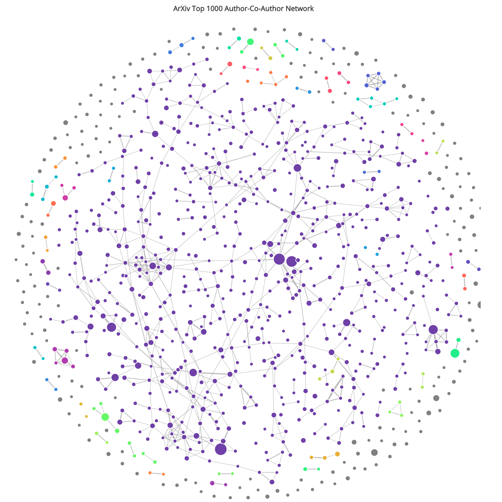

## CS5346 Assignment 3 - CIRViz

<html>
    <table>
        <tr>
            <td>Student Name</td>
            <td>Lu Wei</td>
            <td>Julian Teh</td>
        </tr>
        <tr>
            <td>Matriculation Number</td>
            <td>A0040955E</td>
            <td>A0163126M</td>
        </tr>
    </table>
</html>

### 1. Introduction
The assignment teaches students to handle big data, either by filtering it or cleaning it, and then handling it to extract insights or to explore. In this assignment we split the work into two main portions; exploration of the data, and coding the final visualizations. For exploration we used Tableau with a small dataset to examine any interesting trends, and for the final visualization we used C3.js on top of D3.js to render with the full dataset. 

### 2. Visualizations - Purpose and Method
#### (i)
<html>
    <table>
        <tr>
            <th>Task</th>
            <th>Visualization</th>
        </tr>
        <tr>
            <td>1</td>
            <td>Heatmap</td>
        </tr>
        <tr>
            <td>2</td>
            <td>Categorical Bar Chart</td>
        </tr>
        <tr>
            <td>3</td>
            <td>Time Series Line Chart, Stacked Area Chart</td>
        </tr>
        <tr>
            <td>4a</td>
            <td></td>
        </tr>
        <tr>
            <td>4b</td>
            <td></td>
        </tr>
    </table>
</html>

#### (ii)
Task 1: Heat Map

Task 2: Bar Chart

Task 3: Time Series Line Chart

Task 3: Stacked Area Chart

Task 4a: Stacked Area Chart

Task 4b: Stacked Area Chart

#### (iii)

For Task 3, we encoded the 10 most frequently occuring keywords per year in ICSE publications into a stacked area chart. We first counted and extracted the 10 most frequently occuring keywords, and collected these by year. Using the X-Axis for year, and the Y-Axis for the number of occurrences of the keywords, we mapped out the points, and then connected them using a spline with colored area.

For Task 4 ,

### 3. Other Information
None